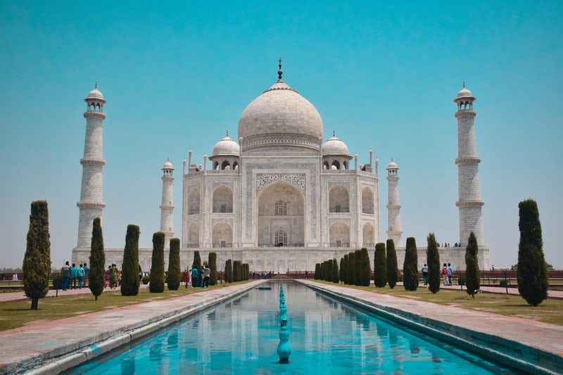
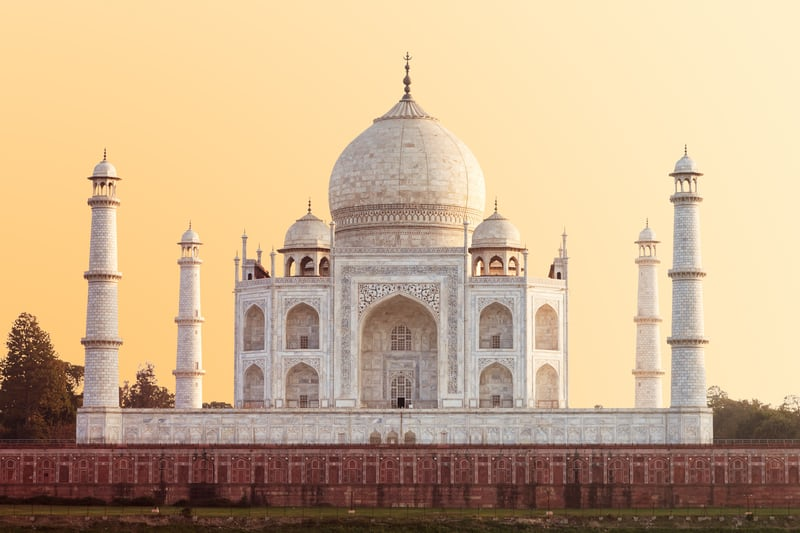
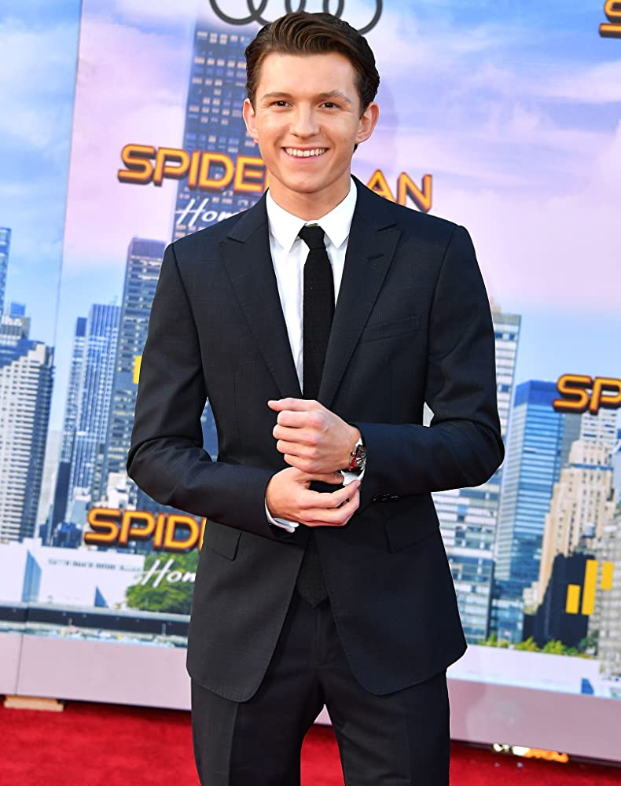

# SIFTImageSimilarity
This repo provides a working interactive code to use SIFT algorithm for image similarity. I have also presented some of the results. Check them out and let me know if you need something more.

#### Requirements:
- Python 3.6.5
- iPython 7
- jupyter notebook 6.0.3
- opencv2
- pickle

## Results
|Image 1|Image 2|Match (%)|Similar|
|:-:|:-:|:-:|:-:|
|||36.2|Yes|
|||63.45|Yes|
|||0.85|No|
|||1.23|No|
|||0.92|No|
|||0.35|No|

The codes available in this repo are tuned specifically to provide amazing results for images which have had the same parent (this means they could be cropped and edited versions of some image). A cut-off of 10% on the score would do the trick.
If you want the codes for identifying similar objects like Taj1 vs Taj2 or Eiffel1 vs Eiffel2, feel free to reach out to me. I am working on it parallely. 
**I really wished Robert and Tom to match though** (cries in the corner) #3000 <3

This algorithm works great when you have descriptors pre-generated for thousands of images and all you want to do is find the images similar a new image.

Thanks to [rmislam](https://github.com/rmislam/PythonSIFT/blob/master/pysift.py) for providing an open-source implementation of the SIFT (David G. Lowe's scale-invariant feature transform) done entirely in Python.

### Questions, Concerns, Bugs

Anyone is welcome to report and/or fix any bugs. I will resolve any opened issues as soon as possible.

Any questions about the implementation, no matter how simple, are welcome. I will patiently explain my code to you.

### *Original Paper*

["Distinctive Image Features from Scale-Invariant Keypoints", David G. Lowe](https://www.cs.ubc.ca/~lowe/papers/ijcv04.pdf)

Definitely worth a read!

### *Legal Notice*

SIFT *was* patented, but it has expired.
This repo is primarily meant for beginners, but feel free to use my code any way you want, commercial or otherwise. All I ask is that you cite or share this repo.

You can find the original (now expired) patent [here](https://patents.google.com/patent/US6711293B1/en) (Inventor: David G. Lowe. Assignee: University of British Columbia.).
