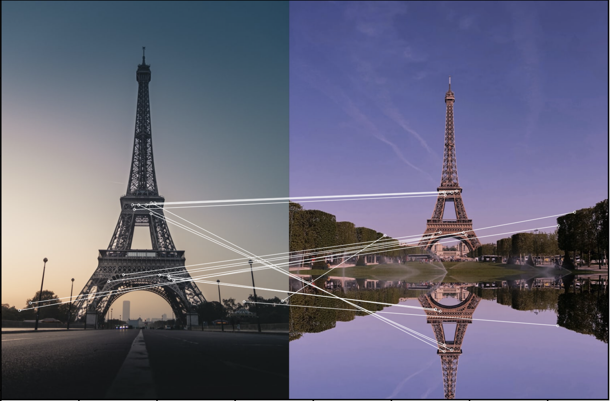

    

# SIFTImageSimilarity
This repo provides a working interactive code to use SIFT algorithm for image similarity. I have also presented some of the results. Check them out and let me know if you need something more.

#### Requirements:
- Python 3.6.5
- iPython 7
- jupyter notebook 6.0.3
- opencv2
- pickle

## Results
|Image 1 vs Image 2|Match (%)|Similar|
|:-:|:-:|:-:|
||9.75|Yes|
||60.86|Yes|
||48.14|Yes|
||0.94|No|
||0.0|No|
||31.26|Yes|
||0.18|No|

The codes available in this repo are tuned such that any score greater than 1.0 means they are a possible match. It works well with rotation and for images captured from different angles as well. However, if it is a 3D object (something with holes/gaps in between) and the view changes completely, it might not be possible for the algorithm to detect stuff. Depending on the use case and how strict you want the comparison, you can tune some parameters and also the cut-off. 
**I really wished Robert and Tom to match though** (cries in the corner) #3000

If you want the codes for identifying similar objects like Taj1 vs Taj2 or Eiffel1 vs Eiffel2 (3D objects), feel free to reach out to me. I am working on it parallely. 

This algorithm works great when you have descriptors pre-generated for thousands of images and all you want to do is find the images similar a new image. 
You can also use the opencv's [FlannBasedMatcher](https://docs.opencv.org/3.4/d5/d6f/tutorial_feature_flann_matcher.html) which is faster in terms of keypoint matching time but a little less accurate. 

Thanks to [rmislam](https://github.com/rmislam/PythonSIFT/blob/master/pysift.py) for providing an open-source implementation of the SIFT (David G. Lowe's scale-invariant feature transform) done entirely in Python. I have added it as a commented code, you can use it incase you want to avoid using opencv's implementation. The only drawback right now is, it is very slow compared to opencv's efficient implementation.

### Questions, Concerns, Bugs

Anyone is welcome to report and/or fix any bugs. I will resolve any open issues as soon as possible.

Any questions about the implementation, no matter how simple, are welcome. I will patiently explain my code to you.

### *Original Paper*

["Distinctive Image Features from Scale-Invariant Keypoints", David G. Lowe](https://www.cs.ubc.ca/~lowe/papers/ijcv04.pdf)

Definitely worth a read!

### *Legal Notice*

SIFT *was* patented, but it has expired.
This repo is primarily meant for beginners, but feel free to use my code any way you want, commercial or otherwise. All I ask is that you cite or share this repo.

You can find the original (now expired) patent [here](https://patents.google.com/patent/US6711293B1/en) (Inventor: David G. Lowe. Assignee: University of British Columbia.).

### Understanding the SIFT algorithm:
For those, looking for resources to help understand the SIFT algorithm, here is an amazing 5 minute video:

  

